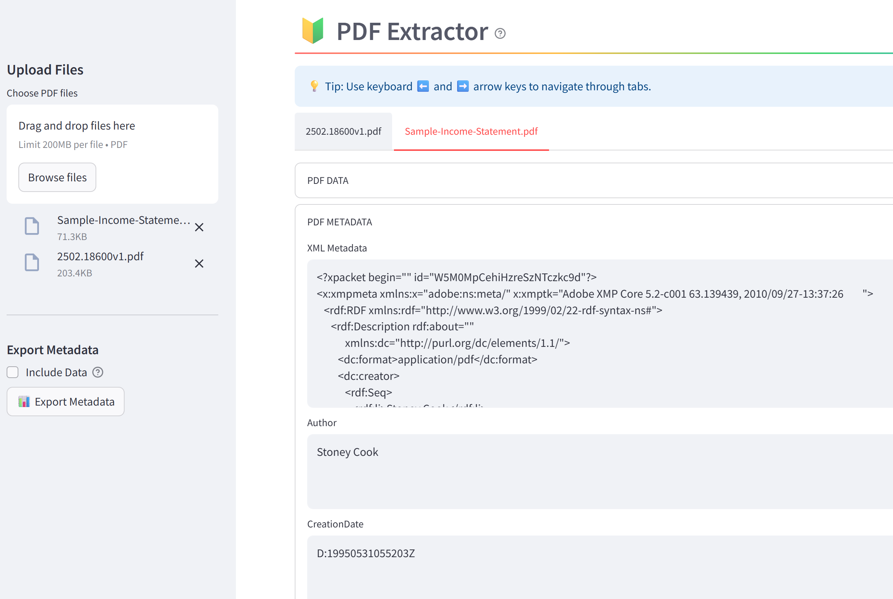

# PDF Extractor

A Streamlit web application that extracts and displays metadata and text content from PDF files.



## Features

- **Upload Multiple PDFs**: Upload one or more PDF files through a simple interface
- **Extract Metadata**: Automatically extract all available metadata from each PDF
- **View PDF Content**: View the full text content of each PDF
- **Tab Navigation**: Easily navigate between multiple PDFs using tabs
- **Export to CSV**: Export all metadata to a CSV file for further analysis
- **Clean UI**: Streamlined user interface with custom styling

## Installation

### Prerequisites

- Python 3.7 or higher
- pip (Python package installer)

### Setup

1. Clone this repository:
   ```
   git clone https://github.com/username/pdf-extractor.git
   cd pdf-extractor
   ```

2. Install the required dependencies:
   ```
   pip install -r requirements.txt
   ```

## Usage

### Running the Application

Run the application with the following command:

```
streamlit run pdf_extractor.py
```

For deployment with a custom base URL path:

```
streamlit run pdf_extractor.py --server.baseUrlPath="/pdf"
```

### Using the Application

1. **Upload PDF Files**:
   - Click the "Choose PDF files" button in the sidebar
   - Select one or more PDF files from your computer

2. **View Metadata**:
   - The application will automatically extract and display metadata for each PDF
   - Navigate between PDFs using the tabs at the top

3. **View PDF Content**:
   - Click the "PDF DATA" expander to view the full text content of the PDF

4. **Export Metadata**:
   - Use the "Export Metadata" button in the sidebar to download a CSV file
   - Optionally include the full PDF text content in the export

## Docker Support

A Dockerfile is included for containerized deployment:

```
docker build -t pdf-extractor .
docker run -p 8501:8501 pdf-extractor
```

To run the application with a custom base URL path in Docker:

```
docker run -p 8501:8501 -e BASE_URL_PATH="/pdf" pdf-extractor
```

The BASE_URL_PATH environment variable is optional. If not specified, the application will run at the root path.

## Technical Details

### Dependencies

- **streamlit**: Web application framework
- **pdfminer.six**: PDF parsing and text extraction
- **pandas**: Data manipulation and CSV export

### Code Structure

- **pdf_extractor.py**: Main application file containing:
  - PDF metadata extraction functions
  - Text content extraction
  - Streamlit UI components
  - CSV export functionality

## Contributing

Contributions are welcome! Please feel free to submit a Pull Request.

## License

This project is licensed under the MIT License - see the LICENSE file for details.
